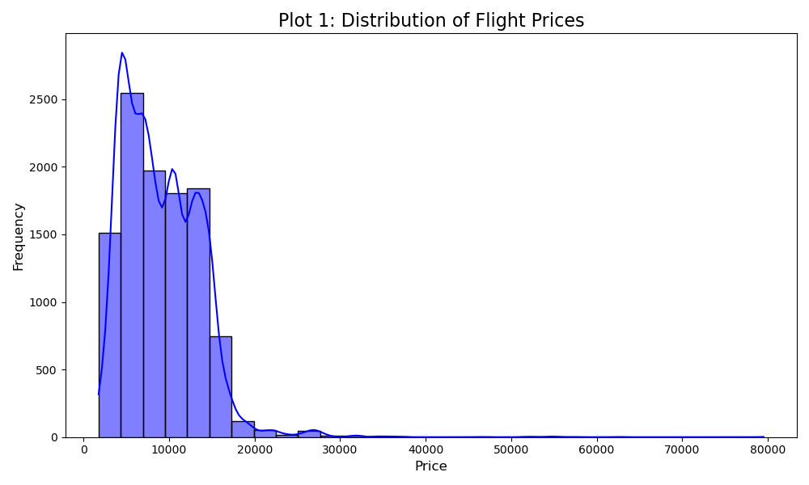
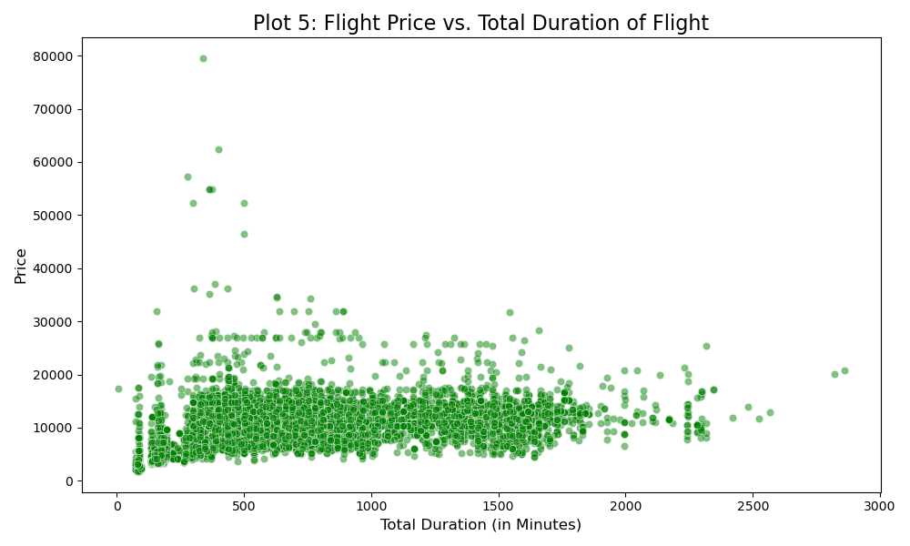

# ✈️ Flight Price Prediction

This project aims to predict flight ticket prices based on various features like airline, date of journey, source and destination, and duration. The entire workflow, from data cleaning and exploratory data analysis to feature engineering and model building, is covered.

---

## 📋 Table of Contents

-   [Project Overview](#-project-overview)
-   [Dataset](#-dataset)
-   [Project Workflow](#-project-workflow)
-   [Exploratory Data Analysis Highlights](#-exploratory-data-analysis-highlights)
-   [Model Training and Evaluation](#-model-training-and-evaluation)
-   [How to Run](#-how-to-run)
-   [Dependencies](#-dependencies)

---

## 🎯 Project Overview

The main objective of this project is to build a machine learning model that can accurately predict the price of a flight ticket. This involves analyzing a dataset of past flight information, identifying key factors that influence the price, and training a robust regression model. The project demonstrates a complete data science pipeline.

---

## 📊 Dataset

The dataset used for this project contains information about flight bookings in India for the year 2019. It was sourced from Kaggle.

**Key features in the dataset include:**
* **Airline:** The name of the airline.
* **Date_of_Journey:** The date of the journey.
* **Source:** The city from which the flight departs.
* **Destination:** The city to which the flight arrives.
* **Duration:** The total travel time of the flight.
* **Total_Stops:** The number of stops between the source and destination.
* **Additional_Info:** Extra information about the flight (e.g., meal inclusion).
* **Price:** The target variable we want to predict.

---

## ⚙️ Project Workflow

The project is divided into two main parts, contained in separate Jupyter Notebooks:

1.  **`EDA_And_FE_Flight_Price.ipynb`**: This notebook covers the initial stages of the project.
    * **Data Cleaning:** Handling missing values and correcting data types.
    * **Feature Engineering:** Extracting meaningful features from existing ones. For instance, `Date`, `Month`, and `Year` are extracted from `Date_of_Journey`. `Duration` is converted into total minutes.
    * **Exploratory Data Analysis (EDA):** Visualizing the data to understand the relationships between different features and the flight price.

2.  **`Model_Training.ipynb`**: This notebook focuses on building and evaluating the prediction models.
    * **Data Preprocessing:** Applying one-hot encoding to categorical features to prepare the data for modeling.
    * **Train-Test Split:** Splitting the dataset into training and testing sets.
    * **Model Selection:** Training several regression models, including RandomForest, XGBoost, and CatBoost.
    * **Hyperparameter Tuning:** Using `GridSearchCV` to find the optimal parameters for the selected models.
    * **Model Evaluation:** Assessing model performance using metrics like **R-squared ($R^2$)**, **Mean Absolute Error (MAE)**, and **Root Mean Squared Error (RMSE)**.
    * **Saving the Model:** The best-performing trained model is saved using `joblib` for future use.

---

## ✨ Exploratory Data Analysis Highlights

Here are some key insights discovered during the EDA phase:

* **Price Distribution:** The distribution of flight prices is right-skewed, with most tickets priced in the lower range and a few expensive outliers.

   

* **Duration vs. Price:** There is a clear positive correlation between the duration of the flight and its price. Longer flights generally cost more.

    

* Remaining Much more in Above Notebooks.

---

## 🤖 Model Training and Evaluation

Several models were trained, with **RandomForest Regressor** and **XGBoost Regressor** showing the best performance after hyperparameter tuning. The models were evaluated based on their ability to generalize on the unseen test data.

The tuned models were saved as:
* `best_randomforest_model.pkl`
* `best_xgboost_model.pkl`
* `best_catboost_model.pkl`

These can be loaded and used for making predictions on new data without retraining.

---

## 🚀 How to Run

To replicate this project on your local machine, follow these steps:

1.  **Clone the repository:**
    ```bash
    git clone <your-repository-link>
    cd <repository-name>
    ```

2.  **Install the required libraries:**
    ```bash
    pip install -r requirements.txt
    ```
    *(Note: You may need to create a `requirements.txt` file using the dependencies listed below.)*

3.  **Run the Jupyter Notebooks:**
    Execute the cells in the notebooks sequentially:
    * First, run `EDA_And_FE_Flight_Price.ipynb` to perform data cleaning, EDA, and feature engineering. This will generate the `encoded_flight_data.csv` file.
    * Next, run `Model_Training.ipynb` to train, evaluate, and save the machine learning models.

---

## 📦 Dependencies

The project relies on the following Python libraries:

* pandas
* numpy
* matplotlib
* seaborn
* scikit-learn
* xgboost
* catboost
* joblib
* warnings

You can install them using pip:
```bash
pip install pandas numpy matplotlib seaborn scikit-learn xgboost catboost joblib
